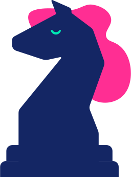
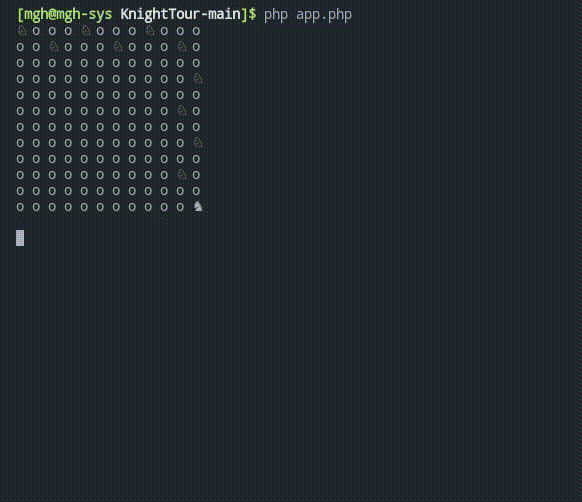

<div align="center">

  
  <h1>Knight's tour problem solver</h1>
  
  <p>
    An awesome README template for your projects! 
  </p>
  
  
<br />
  

<!-- About the Project -->
## :star2: About the Project


<!-- Screenshots -->
### :camera: Screenshots

<div align="center"> 
  
</div>


<!-- Env Variables -->
### :key: Basic Variables

To use this project, you will need to change the following variables to your app.php file

`$x_size = 12;`

`$y_size = 12;`

`$knightPos = ['y' => 1, 'x' => 1];`


<!-- run -->
### :triangular_flag_on_post: run

To run this project, run

```bash
  php app.php
```

<!-- Roadmap -->
## :compass: Todo

* [x] Solve Knight's tour problem
* [x] Update readme 
* [ ] Solve knight's tour problem more dynamically

<!-- Contact -->
## :handshake: Contact

[@MahdiyarDev](https://t.me/MahdiyarDev)

[https://github.com/MahdiyarGHD/KnightTour](https://github.com/MahdiyarGHD/KnightTour)


<!-- Acknowledgments -->
## :gem: Sources

 - [https://en.wikipedia.org/wiki/Knight%27s_tour](https://en.wikipedia.org/wiki/Knight%27s_tour)